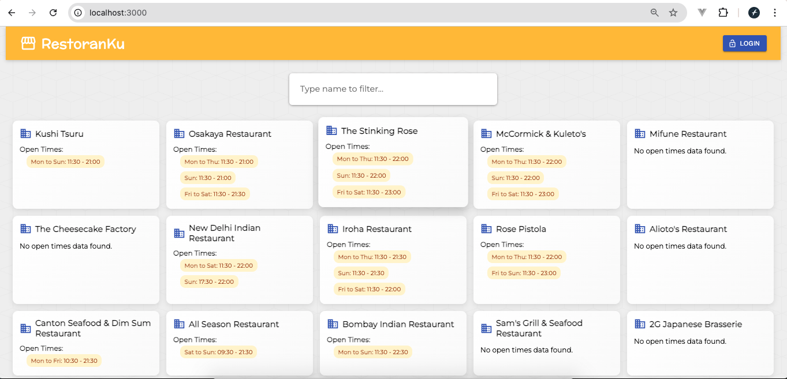

# RestoranKu React Frontend



Restoranku is simple react app project. This project is to fullfill the assignment to apply as fullstack engineer in Goers company.

## Table of Contents

- [Features](#features)
- [Installation](#installation)
- [Usage](#usage)

## Features

- Login as Admin and Register New Admin
- Restaurant management for user with role admin: Easily add, edit, and delete restaurant.
- View all restaurant and do filter based on name, date, or time.

## Installation

1. Clone the repository:

   ```bash
   https://github.com/ThobyGitHub/goers-react-frontend.git
   ```

   For backend project:

   ```bash
    https://github.com/ThobyGitHub/goers-laravel-backend.git
   ```

2. Navigate to the project directory:

   ```bash
   cd your-project
   ```

3. Install node dependencies:

   ```bash
   npm install
   ```

4. Make sure API_URL in `.env` is already correct:

   ```
   .env
   ```

5. Start the react application:

   ```bash
   npm start
   ```

6. Login using demo account (after set up laravel/backend project):

   ```
   user: admin@restoranku.com
   pass: password
   ```

### Usage

Visit `http://localhost:3000` in your browser to access the web-based app.

### Known Issues

1. error due to old version of react-scripts (create react app) dependency
   Error: error:0308010C:digital envelope routines::unsupported
   run:

   ```bash
   export NODE_OPTIONS=--openssl-legacy-provider
   npm start
   ```

### To do

(soon)
